# PCBasic_Brewer_Repo
A repository with all the needed things to run and control BREWER instruments software, under a Pyhton enviroment.
(Not finished yet!!)

Based in the Rob Hagemans PCBasic project: https://github.com/robhagemans/pcbasic/ 

Main programmers: Daniel Santana Díaz, Nestor Morales Hernández.

Principal collaborators: Alberto Redondas Marrero, Sergio Leon Luis, Virgilio Carreño.

## Contents
* **brw#185:** 
Folder of the Brewer program, with all the necessary files to make it run. This includes the main BASIC program "main.asc", routines, schedules, calibration files, etc. The program can be used in both, online and offline mode, having or not a real brewer connected to the serial port. The program needs two enviroment variables set for being able to run: NOBREW, and BREWDIR. (both are set in the launchers.)

* **pcbasic_brewer:** 
PC-BASIC interpreter of robhagermans, specifically customized to handle serial communications with Brewers, and to ignore the extra arguments added by pycharm when debugging.

* **BrewerSimulator.py:**
A program used to simulate the brewer instrument serial port answers, through a virtual com port brigde (com2com software), in order to debug the serial communications in onlne mode, without the need of having a real brewer instrument connected to the pc.

* **.idea:**
This folder is an already configured pycharm project, with all the launchers needed to run pcbasic or the main.asc program into a pygame interface, with line per line debbugging capabilities.


## Installation:
* Install git
* From the git shell, clone recursively the repository into C:\ 
```
git clone --recursive https://github.com/Danitegue/PCBasic_Brewer_Repo

). This will create the repository folder C:\PCBasic_Brewer_Repo\.
```
* Install python 2.7. (Or Anaconda package with python 2.7) 
* Install the python needed extra libraries: 

```
pip install pypiwin32 pysdl2 numpy pygame pyaudio pyserial
```


## Run the PCBASIC interpreter into an ansi console:
* run the launcher C:\PCBasic_Brewer_Repo\pcbasic_brewer\Launcher_pcbasic.bat, a console window will open showing the pcbasic enviroment:

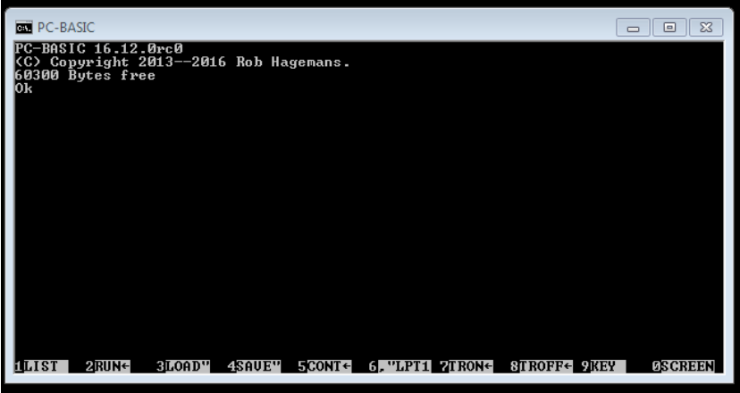


## Configurations needed for running the Brewer Software with PCBASIC: 
* In the provided launchers it is necesary to configure the paths of the brewer software, pcbasic and python.exe, accodingly to the user installation folders. For example, in the launcher file C:\PCBasic_Brewer_Repo\pcbasic_brewer\Launcher_brewer185.bat:

```
rem ****************************************************************************
rem Use the variables in this section to configure the execution of the Brewer program
rem ****************************************************************************

rem PCBASIC_PATH is the path in which the run.py file is located
set PCBASIC_PATH=C:\PCBasic_Brewer_Repo\pcbasic_brewer

rem PYTHON_DIR is the folder in which the python.exe is located
set PYTHON_DIR=C:\Users\DS_Pandora\Anaconda2

rem Set the folder to mount as unit C: (For Brewer soft, we are going to mount the folder where the main.asc BASIC program is as C:)
set MOUNT_C=C:\PCBasic_Brewer_Repo\brw#185\Program

rem Set the folder to mount as unit D: (For brewer soft, we are going to mount the bdata folder as unit D:)
set MOUNT_D=C:\PCBasic_Brewer_Repo\brw#185\bdata185

rem Set the name of the BASIC program to run (For brewer soft, main.asc)
set PROGRAM=main.asc

rem COM_PORT is the identifier of the port in which the brewer is connected, for example COM_PORT=COM8
set COM_PORT=COM14

rem Set the LOG_DIR in order to write the pcbasic session log.
set LOG_DIR=C:\Temp


rem ****************************************************************************
rem Do not change anything below this line
rem ****************************************************************************
```


* Also in the LOG_DIR is going to be written a log file of the pcbasic session (pcbasic_brewer_log.txt). So it is needed to create this folder if it does not exist, otherwise the launcher is not going to work.

```
...  --logfile=C:\Temp\pcbasic_brewer_log.txt

```


* Only in the case of needing an extended debugging file (for COM communications, or memory debug) it is useful to configure the PCBASIC.INI file, which for windows is created after the first launch at 
C:\Users\[username]\AppData\Roaming\pcbasic-dev\PCBASIC.INI, uncommenting the following entries:
  * debug=True
  
  Other options for extended debugging are:
  * To enable the memory addressing messages into the log file: In file \pcbasic_brewer\pcbasic\basic\strings.py; set StringsLogging=True
  * To enable the COM port communication messages into the log file: In file \pcbasic_brewer\pcbasic\basic\devices\ports.py; set self.log_COM_Messages=True
  * To enable the COM port event messages into the log file: In file \pcbasic_brewer\pcbasic\basic\events.py; set self.log_COM_events = True


## Run the Brewer software, offline mode, into an ansi console:
* run the launcher C:\PCBasic_Brewer_Repo\pcbasic_brewer\Launcher_brewer185_nobrew.bat, 
a console window will open showing the main.asc brewer program:

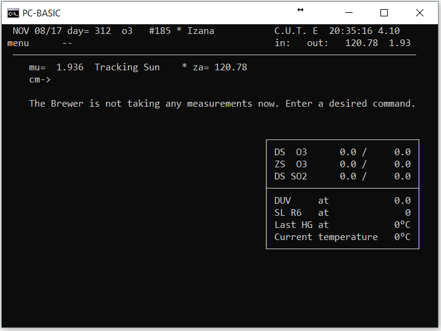

## Test to run some routines into the brewer program:
Once the brewer program is loaded in offline mode, one can try to run some instrument offline-compatible routines to test the proper function of the software. For example just writting pdhp and pressing enter, the program will execute the routine pd and then the routine hp.

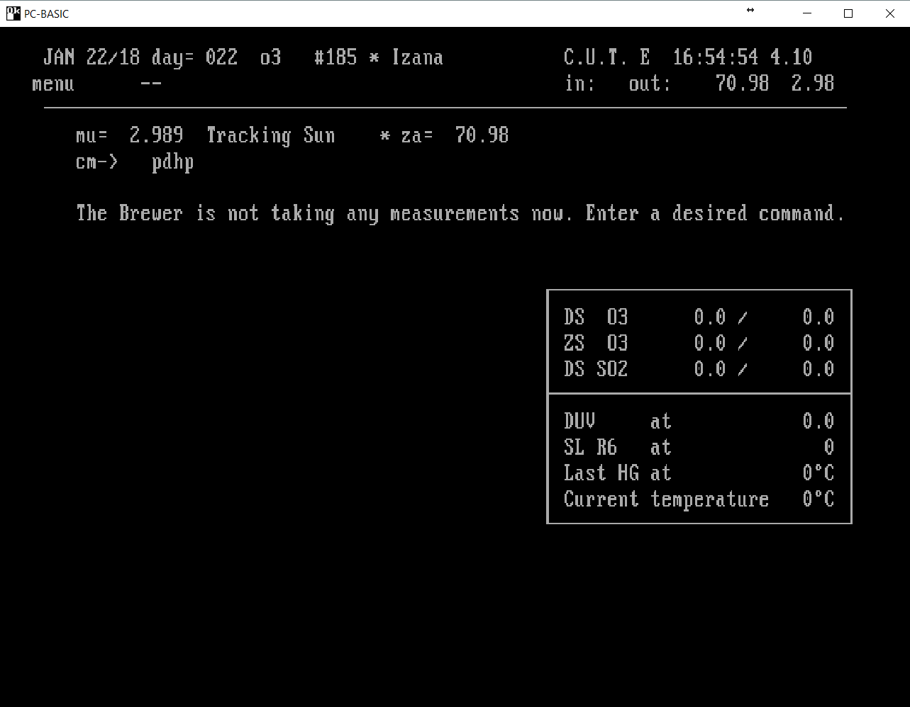

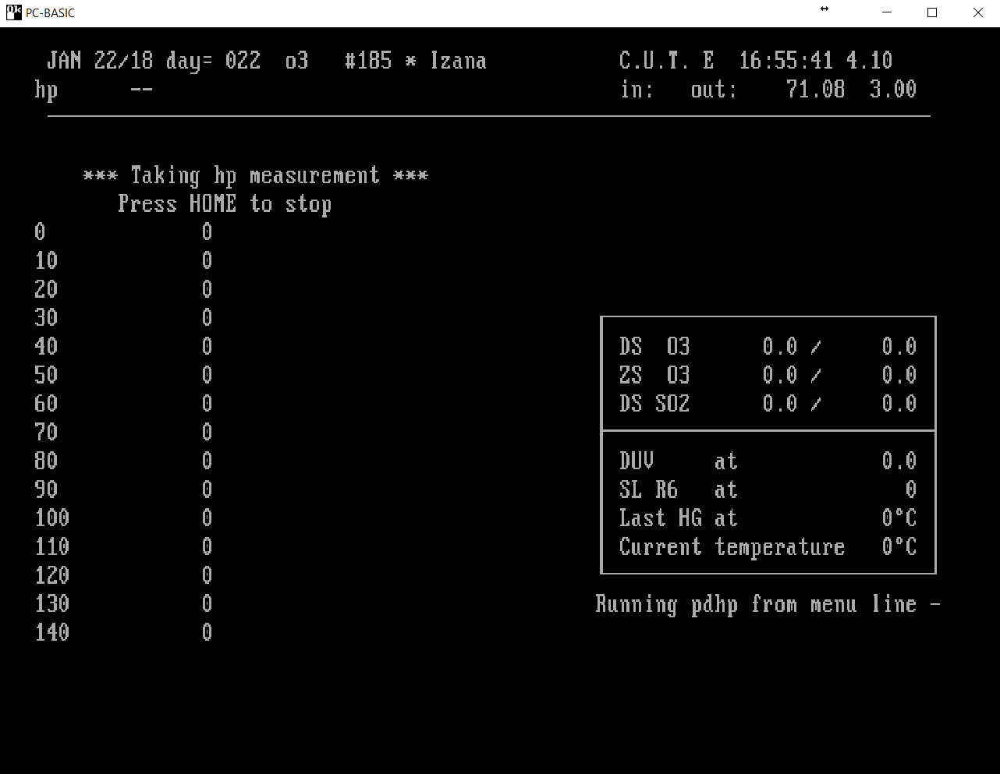

## Run the Brewer software, online mode, into an ansi console:
This allows to control a real instrument connected to the pc.
* Configure the COM port number in the launcher C:\PCBasic_Brewer_Repo\pcbasic_brewer\Launcher_brewer185.bat
* run the launcher.

a console window will open showing the main.asc brewer program, in the same way of the previous images, but with the com port communications enabled, and being able to control a real instrument through the configured com port. 


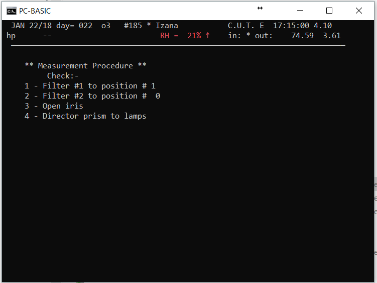
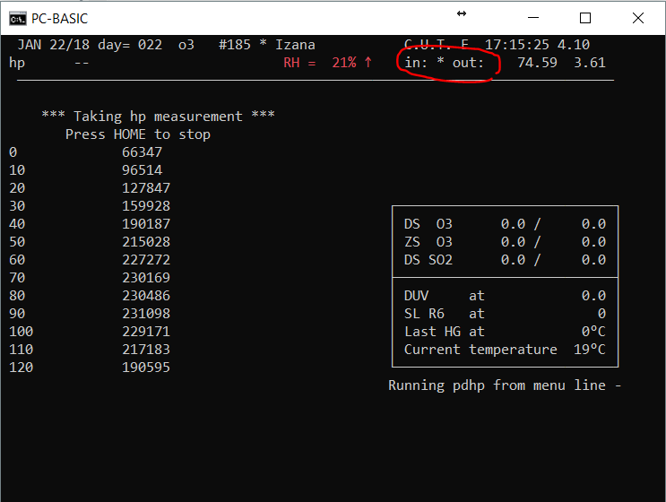


-----------------------------------------------------------------------------------------------
## Brewer Simulator:
This is a small script that simulates the instrument com port answers when connecting, and also the answers for a few brewer routines like hp or hg (only these ones for now). It is used for debugging the pcbasic com port communications, without the need of having a real instrument connected to the pc.

For using it, it is needed install a com bridge in the pc (in windows can be used the com0com software, for example), and also configure the Brewer launcher to use the com port number of the bridge.

One must run the BrewerSimulator.py script (cd C:\PCBasic_Brewer_Repo; python C:\PCBasic_Brewer_Repo\BrewerSimulator.py) before running the online Brewer Launcher (C:\PCBasic_Brewer_Repo\pcbasic_brewer\Launcher_brewer185.bat).

In the case of an installed COM14&COM15 bridge, and a Brewer launcher configured to use the COM14 the communications will be: 

* pcbasic <-> COM14 (Brewer software)
* COM14 <-> COM15 (COM Bridge)
* BrewerSimulator <-> COM15 (Instrument simulator)

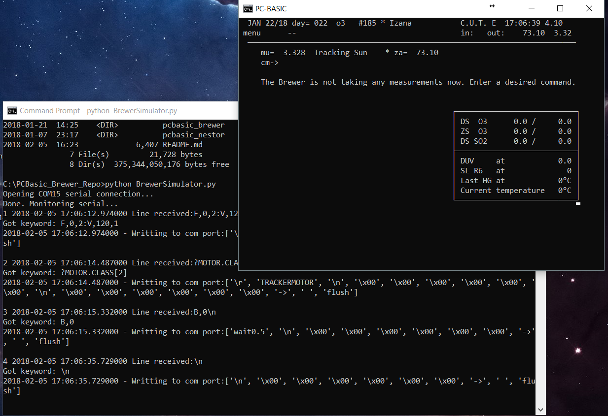

----------------------------------------------------------------------------------
## Connect the brewer software with the outside world: Using PCBasic Extensions 

the pcbasic extensions are explained here: https://github.com/robhagemans/pcbasic/blob/master/docsrc/devguide.html
here some examples:

### Simple Extensions:
The simple extensions of pcbasic allows to:
* trigger python procedures from BASIC routines.
* Call to python functions from BASIC routines, (allowed to return one unique value per function).


#### Simple Extension example 1 - Trigger a python procedure form a "special" BASIC statement (No return): 

Having a BASIC routine like this "C:\PCBasic_Brewer_Repo\brw#185\Program\pu.rtn" (notice the non BASIC code _MKBACKUP): 

```
10000 REM ************ PU.rtn ************
10010 DATA pu
11020 B$="MAKING BACKUP BY EXTENSION FUNCTION MKBACKUP":PRINT#4,B$
11030 _MKBACKUP
11040 RETURN
55555 '
65529 REM proper last line
```

and a pcbasic extension: "C:\PCBASIC_Brewer_Repo\Brw_extensions_simple1.py":

```
import shutil
def mkbackup():
    try:
        filename='test.txt'
        sourcepath='C:/filepath_source/'
        targetpath='C:/filepath_target/'
        shutil.copy2(sourcepath+filename, targetpath)
    except:
        pass
```

if the pcbasic launcher has the extra argument "--extension=Brw_extensions_simple1", pcbasic will load the functions and procedures of the extension module, in a way that when the special BASIC statement _MKBACKUP of the PU.rtn routine is going to be executed, pcbasic automatically detects that it is not a BASIC syntax, and it will try to look in the loaded extension functions for a proper function or procedure to "solve" the statement. Of course the function match is not case sensitive, so the _MKBACKUP basic statement can be handled by a "mkbackup()" as well as a "MkBackup()" python functions.

In this case, when loading the brewer software with this extra argument in the launcher, and running the "pu" routine from the brewer software command line, the pu BASIC routine is going to trigger the mkbackup() python procedure, which will be in charge of make wathever in the python world, in this case a backup of a file.

In the output file #4 (which in this case corresponds to the D02018.185 file), will be written:

```
PROGRAM start : JAN 20/18 at 23:44:50
MAKING BACKUP BY EXTENSION FUNCTION MKBACKUP
```


### Simple Extension example 2 - Use a python function to solve a "special" BASIC statement: 

Having a BASIC routine like this "C:\PCBasic_Brewer_Repo\brw#185\Program\py.rtn" (notice the non BASIC code _DUPLICATE(2)): 

```
10000 REM ************ PY.rtn ************
10010 DATA py
11020 B$="RESULT OF DUPLICATE(2)="+STR$(_DUPLICATE(2)):PRINT#4,B$
11030 RETURN
55555 '
65529 REM proper last line
```

and a pcbasic extension: "C:\PCBASIC_Brewer_Repo\Brw_extensions_simple2.py":

```
def duplicate(n):
    try:
        return 2*int(n)
    except IndexError:
        return -1
```


In the same way of the previous example, launching the brewer software with the extra argument --extension=Brw_extensions_simple2, and running the "py" routine from the brewer software command line, the py BASIC routine is going to use the duplicate(2) python function to solve the value of the _DUPLICATE(2) statement. Notice that the python function only can return one value result per call.

In the output file #4 (which in this case corresponds to the D02018.185 file), will be written:

```
PROGRAM start : JAN 20/18 at 23:44:50
RESULT OF DUPLICATE(2)= 4
```


### Advanced Extensions:
In these extensions, it is inherited the session class of the pcbasic, where we can have access to all the variables in the BASIC world at the same time (and much more). This can be used for:
* Get and set the BASIC variables from python using the .get and .set methods of the session class.
* Make python plots with the variable values stored in the memory.


### Advanced extension example 1:

Having a BASIC routine like this "C:\PCBasic_Brewer_Repo\brw#185\Program\px.rtn" (notice the non BASIC code _HFSWITCH): 

```
px.rtn:
10000 REM ************ PX.rtn ************
10010 DATA px
11020 B$="HF% VALUE="+STR$(HF%):PRINT#4,B$
11025 _HFSWITCH
11030 B$="HF% VALUE="+STR$(HF%):PRINT#4,B$
11030 RETURN
55555 '
65529 REM proper last line
```

and a pcbasic extension like this: "C:\PCBASIC_Brewer_Repo\Brw_extensions.py": 


```
from pcbasic.basic import Session

class ExtendedSession(Session):
    def __init__(self):
        Session.__init__(self, stdio=True, extension=self)

    def getHF_session(self):
        hf=self.get_variable("HF%")
        return hf
    
    def setHF_session(self,value):
        self.set_variable("HF%",value)
        
def HFswitch():
    try:
        with ExtendedSession() as s:
            HF=s.getHF_session()
            if HF==1:
               s.setHF_session(0)
            elif HF==0:
               s.setHF_session(1)
    except IndexError:
        return -1
```

The _HFSWITCH BASIC statment will trigger the HFswitch() python procedure, and it will use the inherited session class to get and set the values of the BASIC variables with the .get and .set procedures, in order to switch the value of the variable HF%

In the output file #4 (which in this case corresponds to the D02018.185 file), will be written:

```
PROGRAM start : JAN 21/18 at 00:49:49
HF% VALUE= 0
HF% VALUE= 1
```


----------------------------------------------------------------------------------

## For running or debugging pcbasic with pycharm:

### Prepare pycharm:
For being able to run pcbasic programs from pycharm with line per line debbuging capabilities is needed to configure pycharm:
* Open pycharm
* Go to File > Open > Select the repo folder C:\PCBasic_Brewer_Repo, and it automatically will detect the existing project into the .idea folder. Open the project.
* Prepare the debugging configurations: go to Run > Edit Configurations... here is needed to adapt the paths of the script, installed python interpreter, and working directory for each configuration, with the correct paths in your PC.

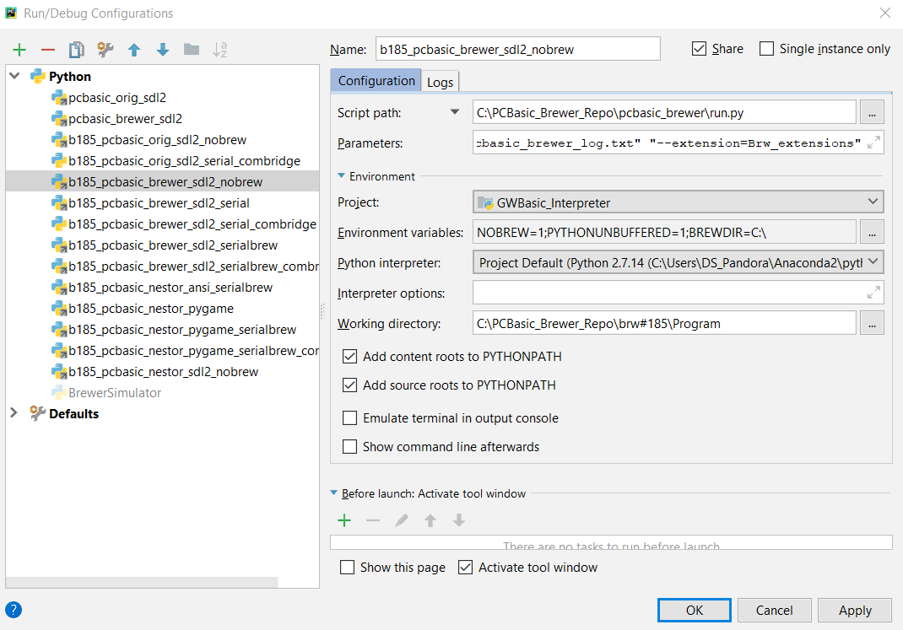

in the parameters section of every pycharm launcher one can see the parameters used to launch the pcbasic session. 

here an example of the parameters and enviroment variables used for a offline launcher:

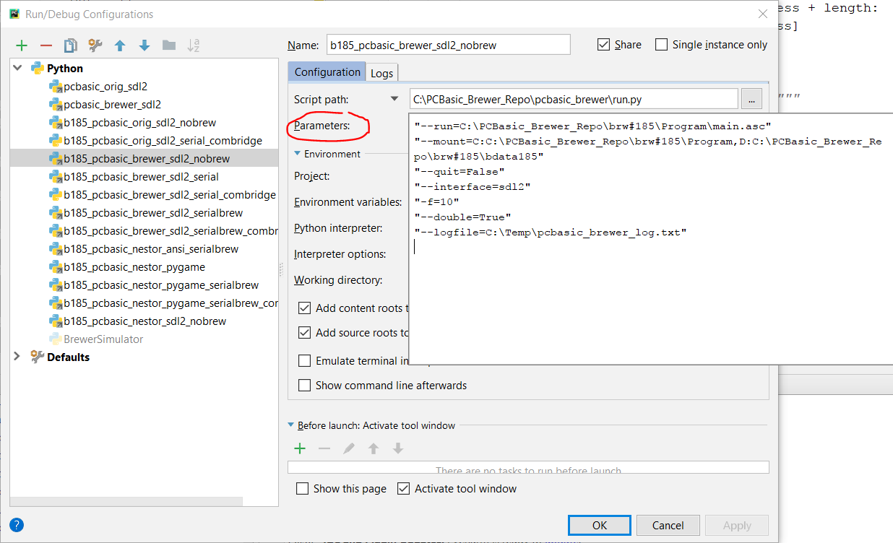

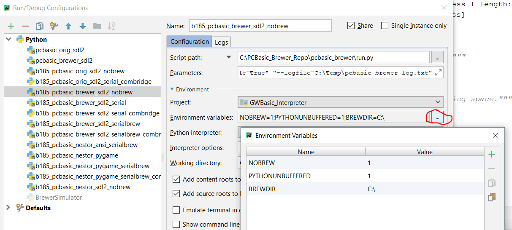


and here an example of the parameters and enviroment variables used for a online launcher:

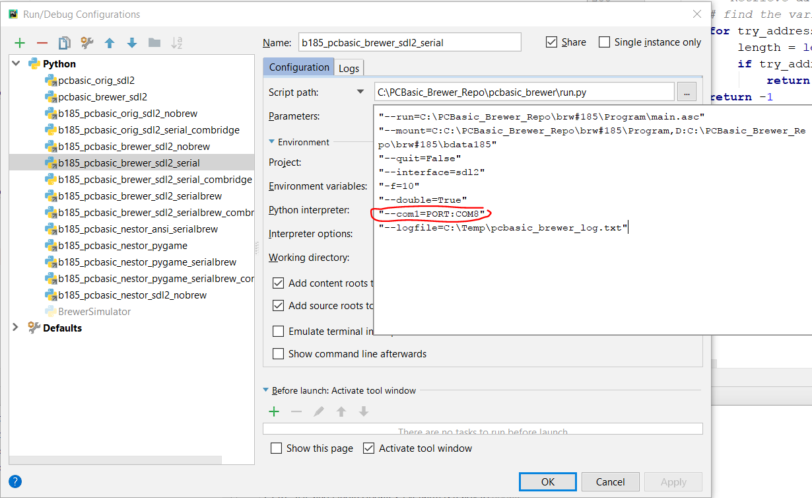

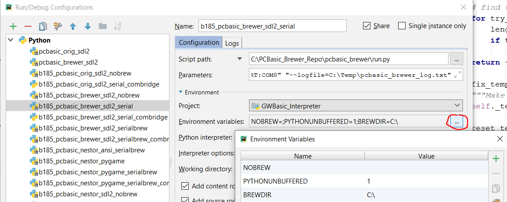


### Test the Brewer software from pycharm, offline mode, into a sdl2 console:
* In the configuration selector of pycharm, select b185_pcbasic_brewer_sdl2_nobrew, then run or debug the configuration as prefered.

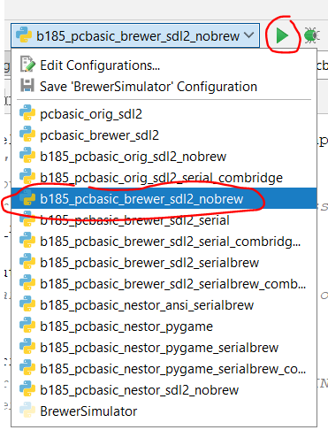

### Test the Brewer software from pycharm, online mode, into a sdl2 console:
* In the configuration selector of pycharm, select b185_pcbasic_brewer_sdl2_serial to control a real instrument, or the b185_pcbasic_brewer_sdl2_serial_combridge for using it with a previously opened BrewerSimulator.py script. Then run or debug the configuration as prefered.

(The unique diference btw these two online launchers is the com port number).

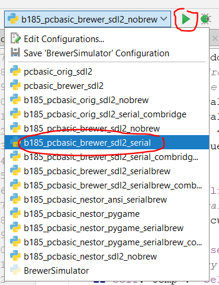


-------------------------------------------------------------

